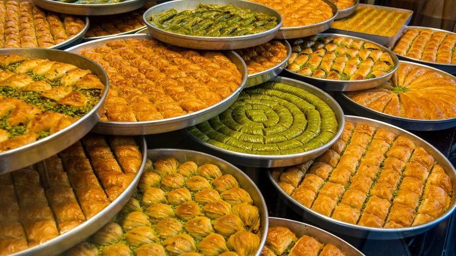

# Heading level 1
### Heading level 3

1. First item
2. Second item
3. Third item
4. Fourth item

* First item
* Second item
* Third item
* Fourth item

This text is ***really important***.

### This is a REMOTE change :O
# Traditional Baklava Recipe
line 2 changed remotely

Baklava is a rich, sweet dessert made of layers of phyllo dough filled with chopped nuts and sweetened with syrup or honey. This step-by-step guide will help you create a delicious, flaky, and syrupy baklava that is perfect for any occasion.

You will love Baklava when you taste it!
### This is a REMOTE change :O

